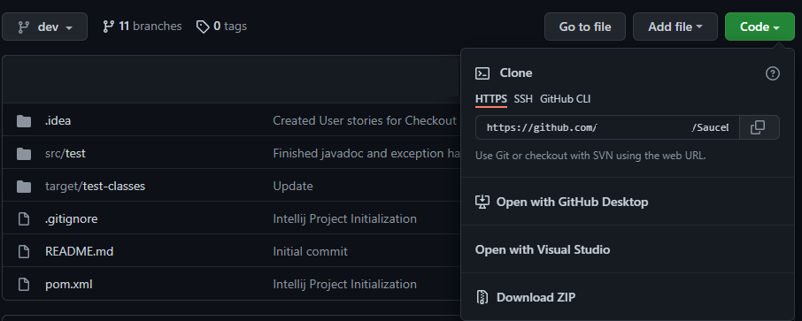
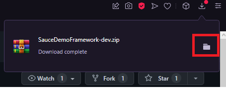
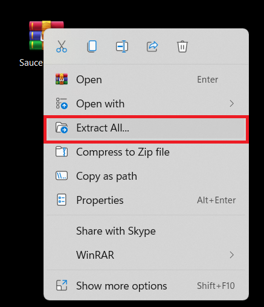
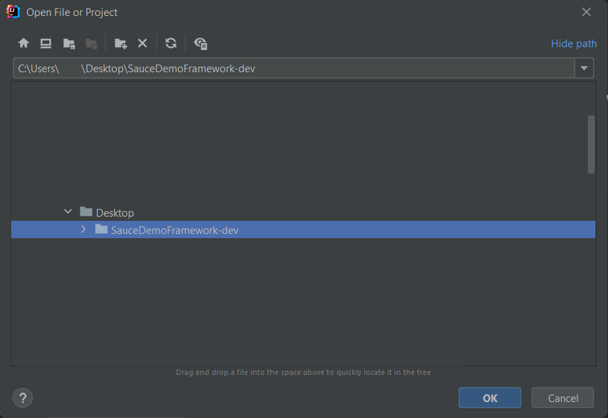
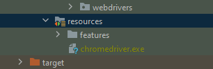
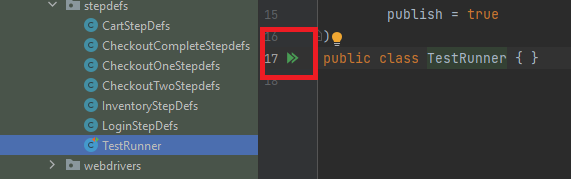
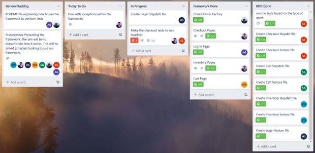

# Sauce Demo Framework
> Developed By:
>
> • Sami Zirak - Junior Java SDET Consultant | [Portfolio](https://samiz.dev/) | [GitHub](https://github.com/samizirakgamedev) | [LinkedIn](https://www.linkedin.com/in/sami-zirak-dezfouly/) | [Twitter](https://twitter.com/SamiZirakDev) |
>
> • Natasha Reilly - Junior Java SDET Consultant | [GitHub](https://github.com/nreilly112) | [LinkedIn](https://www.linkedin.com/in/natasha-reilly-355450189/) |
>
> • Álvaro González - Junior Java SDET Consultant | [GitHub](https://github.com/Alvaropz) | [LinkedIn](https://www.linkedin.com/in/alvaropzgz/) |
>
> • Dale Bernardo - Junior Java SDET Consultant | [GitHub](https://github.com/DalePBernardo) | [LinkedIn](https://www.linkedin.com/in/dale-bernardo-3a8063215/) |
>
> • Sajad Gulzar - Junior Java SDET Consultant | [GitHub](https://github.com/SajadGulzar) | [LinkedIn](https://www.linkedin.com/in/sajad-gulzar-322788156/) |
>
> • Suyash Srivastava - Junior Java SDET Consultant | [GitHub](https://github.com/SuyashsGit) | [LinkedIn](https://www.linkedin.com/in/suyash-srivastava-0a977a15a/) |
>
> • Ben Wong - Junior Java SDET Consultant | [GitHub](https://github.com/BwongmcST) | [LinkedIn](https://discord.com/channels/932614899165700126/948513533979676692/948581808281387079) |
>
A testing framework for https://www.saucedemo.com/ using Selinium. This project is part of our ongoing training @ [Sparta Global](https://www.spartaglobal.com/).
### Table Of Contents ###
+ [Software & Dependencies](#software-&-dependencies)
+ [How To Use](#how-to-use)
+ [Project Scope](#project-scope)
+ [Project Management](#project-management)
+ [Testing Framework](#testing-framework)
+ [Outcomes and Future Work](#outcomes-and-future-work)
### Software & Dependencies ###
* **IntelliJ Community Edition** [Version 2021.3.2](https://www.jetbrains.com/idea/download/#section=windows)
* **JDK** [Version 17.0.2](https://jdk.java.net/17/)
* **Apache Maven**
    * **Note:** This dependency can be imported using IntelliJ.
    * _Go to **"File" > "New Project"** and then selecting **"Maven"** as the project structure._
* **JUnit Jupiter API** [Version 5.8.2](https://mvnrepository.com/artifact/org.junit.jupiter/junit-jupiter-api/5.8.2)
    * _**Note:** This dependency can be imported within Intellij using Apache Maven and IntelliJ's built-in dependency generator._
    * Alternatively you can open the Maven **"pom.xml"** file and paste in the following code within the **"dependencies"** section of the file:
```xml
    <dependency>
        <groupId>org.junit.jupiter</groupId>
        <artifactId>junit-jupiter</artifactId>
        <version>5.8.2</version>
    </dependency>
```
* **JUnit Vintage Engine** [Version 5.6.1](https://mvnrepository.com/artifact/org.junit.vintage/junit-vintage-engine/5.6.1)
  * _**Note:** This dependency can be imported within Intellij using Apache Maven and IntelliJ's built-in dependency generator._
  * Alternatively you can open the Maven **"pom.xml"** file and paste in the following code within the **"dependencies"** section of the file:
```xml
   <dependency>
        <groupId>org.junit.vintage</groupId>
        <artifactId>junit-vintage-engine</artifactId>
        <version>5.6.1</version>
        <scope>test</scope>
    </dependency>
```

* **Selenium Java** [Version 4.1.2](https://mvnrepository.com/artifact/org.seleniumhq.selenium/selenium-java/4.1.2)
    * _**Note:** This dependency can be imported within Intellij using Apache Maven and IntelliJ's built-in dependency generator._
    * Alternatively you can open the Maven **"pom.xml"** file and paste in the following code within the **"dependencies"** section of the file:
```xml
    <dependency>
        <groupId>org.seleniumhq.selenium</groupId>
        <artifactId>selenium-java</artifactId>
        <version>4.1.2</version>
    </dependency> 
```
* **Cucumber JVM: Java** [Version 7.2.3](https://mvnrepository.com/artifact/io.cucumber/cucumber-java/7.2.3)
    * _**Note:** This dependency can be imported within Intellij using Apache Maven and IntelliJ's built-in dependency generator._
    * Alternatively you can open the Maven **"pom.xml"** file and paste in the following code within the **"dependencies"** section of the file:
```xml
    <dependency>
        <groupId>io.cucumber</groupId>
        <artifactId>cucumber-java</artifactId>
        <version>7.2.3</version>
    </dependency> 
```
* **Cucumber JVM: JUnit** [Version 7.2.3](https://mvnrepository.com/artifact/io.cucumber/cucumber-java/7.2.3)
    * _**Note:** This dependency can be imported within Intellij using Apache Maven and IntelliJ's built-in dependency generator._
    * Alternatively you can open the Maven **"pom.xml"** file and paste in the following code within the **"dependencies"** section of the file:
```xml
    <dependency>
        <groupId>io.cucumber</groupId>
        <artifactId>cucumber-junit</artifactId>
        <version>7.2.3</version>
    </dependency>
```
<br/>
<div align="right">
    <b><a href="#sauce-demo-framework">↥ back to top</a></b>
</div>
<br/>

### How to use ###

1. Navigate to the top of this GitHub repo and click the green **Code** button. This will open a menu where you will want to click **Download Zip**.
   
    

2. Having clicked **Download ZIP** a **Show In Folder** dialogue box will open. Choose where you want to store the compressed Sauce Demo Framework program and then click the **Save** button.
   
    

3. Using Windows Explorer navigate to the location you saved the compressed Sauce Demo Framework program in. Right-click on the program and select **Extract All**.
   
    
   
4. Open IntelliJ Community Edition and click **File** and then **Open**. Navigate to the extracted Sauce Demo Framework program project folder and select it. Then click **Ok**.
  
    

5. This project doesn't include the Web Drivers for the different browsers, so, you must download and place them into the right folder. The standard folder path used for this project is **src/test/resources/{webDriver_file_name}"**. In this example is shown **ChromeDriver.exe** as web driver used.
   
    
   
6. Once the project has opened and all dependencies have been downloaded you must run the **TestRunner** file. This file should be in **src/test/java/org/runewriters/stepdefs**. This will allow you to run all *features* files in one go. You can now run the program by clicking the green play button.
   
    


<br/>
<div align="right">
    <b><a href="#sauce-demo-framework">↥ back to top</a></b>
</div>
<br/>

### Project Scope ###

The framework worked under the [Project Object Model](https://en.wikipedia.org/wiki/Apache_Maven#Project_Object_Model),
which provides all the configuration for a single project:
* **POM**: Classes that represent the methods with different behaviours in each web page.
* **Step Defs**: The actual tests based in BDD. This is backside of the user stories.
* **Web Drivers**: Drivers that allows you to test the *feature* files in different browsers.
* **Feature Files**: Files that represent the user stories adapted to BDD. Each scenario represents an user
behaviour on the website through different web pages.

<br/>
<div align="right">
    <b><a href="#sauce-demo-framework">↥ back to top</a></b>
</div>
<br/>

### Project Management ###

Throughout the project we made use of multiple project management tools including:

* GitHub, GitHub Desktop and Sourcetree for version control.
* Trello for sprint and task management.
* Microsoft Teams and Discord for collaborative working and meetings. 

Bellow is a commit graph showing the commit history of the project:


We each branched off and worked on our separate tasks and would then merge together to update each of our branches with an up-to-date version of the project. On the last day of the project we branched off less and merged in more frequently to refactor,make final updates and fix bugs.

Our trello was also updated throughout our project to reflect the completion of deadlines and the completion of sprints and tests.



<br/>
<div align="right">
    <b><a href="#sauce-demo-framework">↥ back to top</a></b>
</div>
<br/>

### Testing Framework ###

**JUnit Automatic Testing**:

JUnit Testing is a series of automatic tests that can be designed in a method that is easy to understand, a third party 
user should also be able to create and use tests using the same format. JUnit Testing was used in this project two check 
if the expected results matched with the actual outcome of the user stories through *Assertions*.

**User Stories - Cucumber**:

This framework is based on the idea of BDD. This describes a series of scenarios that a user might follow to reach a 
specific part of the website. This is very useful for both, technical and non-technical people.

The framework processed different feature files. The results are displayed in the next table:

| Test Type         | Test Results |
|-------------------|:------------:|
| Login             | Passed       |
| Inventory         | Passed       |
| Cart              | Passed       |
| Checkout 1        | Passed       |
| Checkout 2        | Passed       |
| Checkout Complete | Passed       |
| Twitter           | Passed       |
| Facebook          | Passed       |
| LinkedIn          | Passed       |

Feature Files Test Result:


**Note:** Other problematic users passed the tests due to the way it was tested against; for example, 
a locked_out user was tested against not being logged in after entering its details rather than testing
against if the user was taken to the home page.

<br/>
<div align="right">
    <b><a href="#sauce-demo-framework">↥ back to top</a></b>
</div>
<br/>

### Outcomes and Future Work ###

After testing the website, the team found that some improvements that could be made on the website from the perspective
of the users. These improvements were:

* [Regex](https://en.wikipedia.org/wiki/Regular_expression) user input validation. For example, checking if the user's 
first and last name are only alphabetic characters.
* Ability to change product quantity of an item in the cart (From different pages in the website such as the inventory, 
cart and checkout page).
* The mouse cursor should change when hovering the cart icon to indicate that it is clickable (like other page icons do).
* Don’t allow users to check out without an item in the cart.


<br/>
<div align="right">
    <b><a href="#sauce-demo-framework">↥ back to top</a></b>
</div>
<br/>
